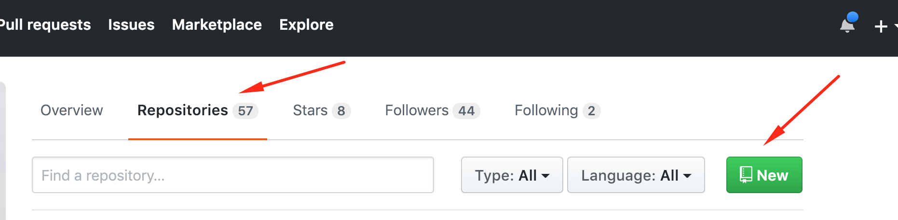
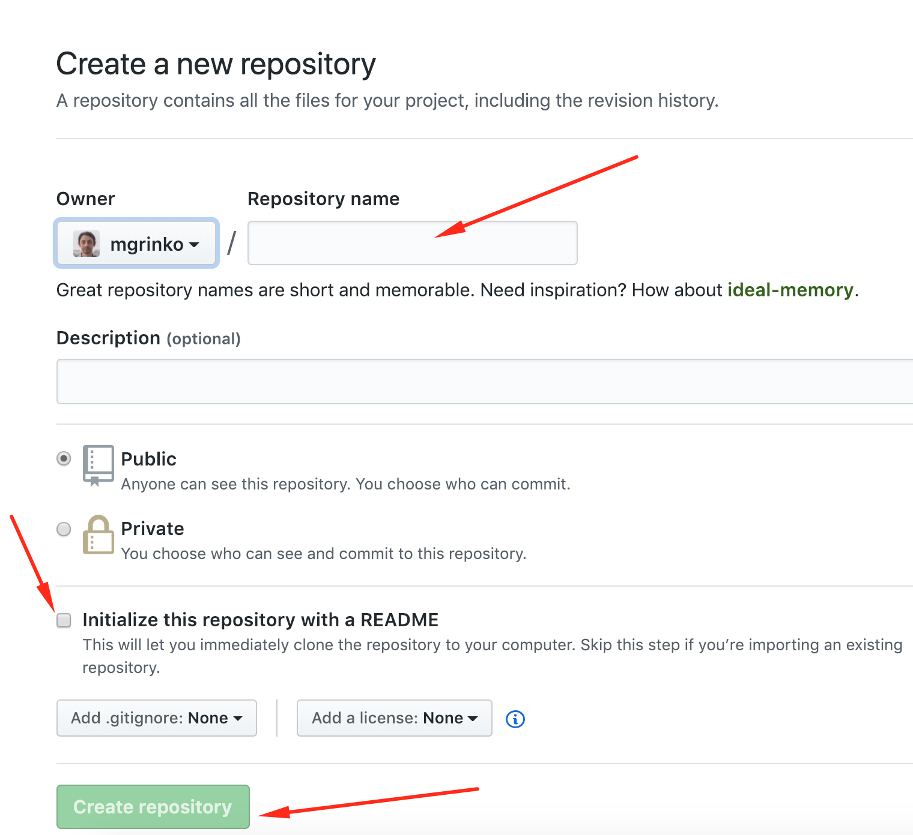
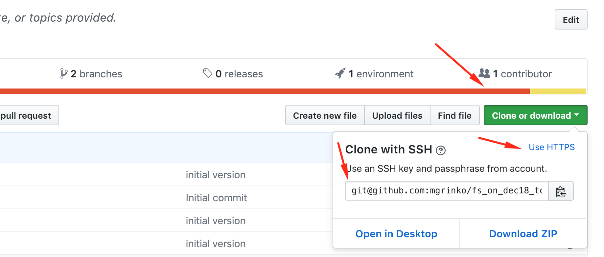
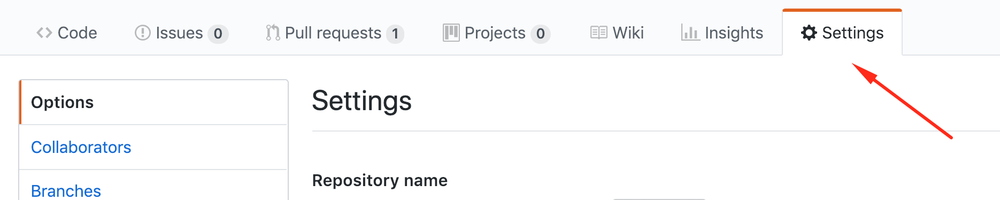
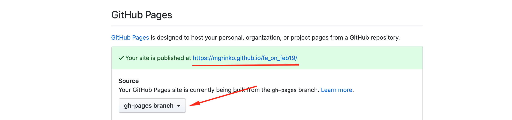
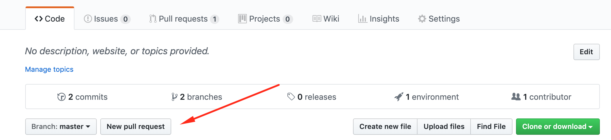
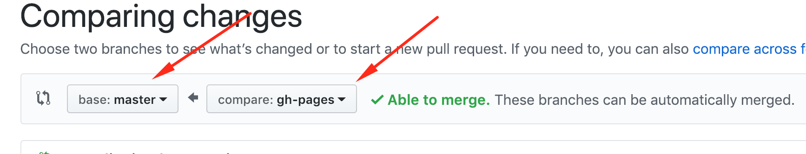
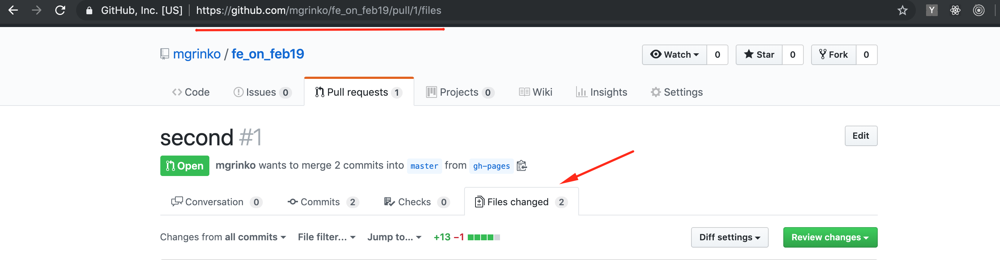

# Github Workflow

## Create a `projects` Folder

If you’re a…

- **Windows user**, then create `C:\projects` or use any other location. DON’T create projects folder on your desktop.
- **macOS** user, then open any `terminal` and run `mkdir` `~/projects` to create a `projects` folder in your `home` folder.

Your path shouldn’t contain spaces and `non-latin` letters.

## Create a Repo

Create a repository with a README file on `Github`.
Click `Clone or download` and copy the link (`https` one).







## Get the Repo

1. Open your `projects` folder in your terminal. If you are a…

    - **Windows user**, then go to you `projects` folder in `explorer`, right click on empty space and run `GitBash here`.
    - **macOS user**, open terminal and run `cd ~/projects` (the path to your `projects` folder).

2. Run below command to clone the project from Github, but with the copied link:

    ```bash
    git clone the-link-copied-from-github-repo
    ```

    If you encounter an issue on **Windows**, run `git init` and restart `GitBash`.

3. Open the project in `VSCode`.

4. Create `.gitignore` file with the following text:

    ```text
    .idea
    .vscode
    ```

5. Open the terminal in VSCode and run `git status` to see what files are tracked by `git`.

6. Save changes:

    - First, prepare `.gitignore` file for saving:

        ```bash
        git add .gitignore
        ```

    - Second, save prepared changes (the text in `''` after `-m` is just a description):

        ```bash
        git commit -m '.gitignore was added'
        ```

7. Send the changes to Github

    ```bash
    git push origin main
    ```

8. Check on Github if you can see the `.gitignore` file there.

## `gh-pages`

1. Create a branch with:

    ```bash
    git branch gh-pages
    ```

    - If you want to delete a branch, use git branch -D gh-pages.

2. Activate the branch with:

    ```bash
    git checkout gh-pages
    ```

    - Check if `gh-pages` is now an active branch with `git branch`.

3. Create `index.html` file:

    ```html
    <h1>Hello world!</h1>
    ```

4. Save the file:

    ```bash
    git add index.html
    ```

    …and

    ```bash
    git commit -m 'create index.html'
    ```

5. Send `gh-pages` branch to Github:

    ```bash
    git push origin gh-pages
    ```

6. Check on Github if the `index.html` file is present.

7. In the project settings, select `gh-pages` branch as your source for the public page.

    

    

Congratulations, you’ve just deployed your first web-site!

## Pull Request (PR)

1. Create a Pull Request (PR) on GitHub, selecting `main` as the base branch and `gh-pages` as the branch to compare.

    

    

2. Navigate to the `Files` tab and verify that your index.html code is visible.

    

3. Include links to your GitHub page in the Pull Request description.

    ```text
    [My page](https://your-name.github.io/your-repo/)
    ```

    - Replace `your-name` and `your-repo` with the appropriate values.
    - Ensure the link directs to your public page.
    - For tips on formatting comments, explore the [Markdown](https://github.com/adam-p/markdown-here/wiki/Markdown-Cheatsheet) guide.

**To complete this task, please attach the link to your Pull Request**.
